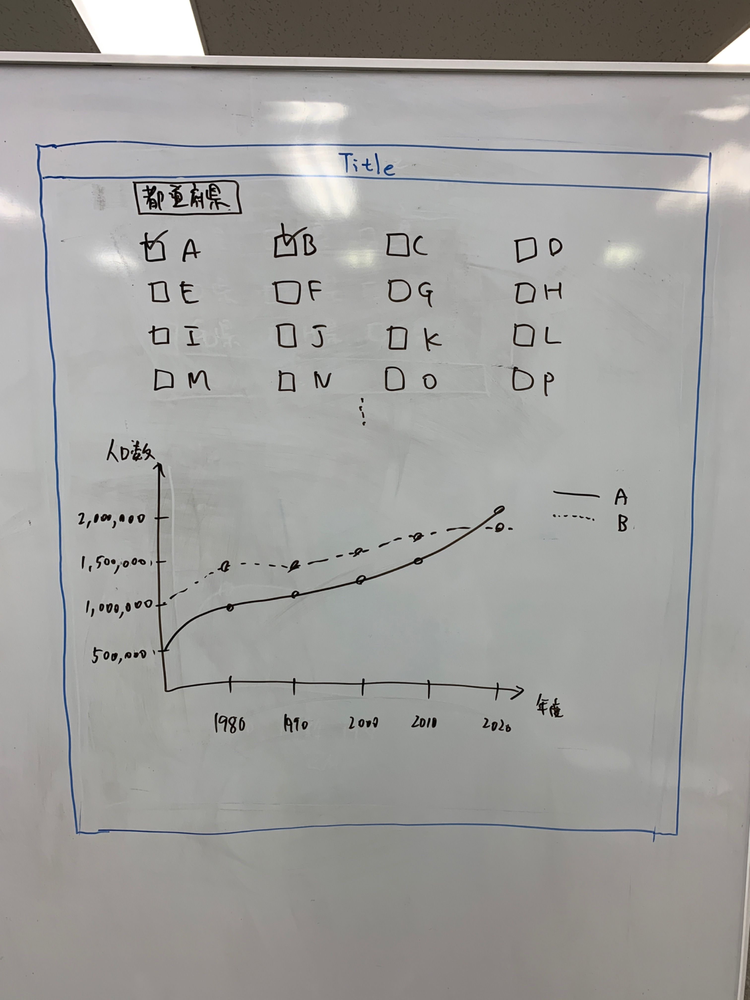

# yumemi_frontend_submission

ゆめみようなフロントエンド送信です。

## プロジェクト詳細

* 都道府県別の総人口推移グラフを表示するSPA(Single Page Application)を構築せよ



### 内容
1. RESAS(地域経済分析システム) APIの「都道府県一覧」からAPIを取得する
2. APIレスポンスから都道府県一覧のチェックボックスを動的に生成する
3. 都道府県にチェックを入れると、[RESAS API](https://opendata.resas-portal.go.jp/docs/api/v1/index.html)から選択された都道府県の「人口構成」を取得する
4. 人口構成APIレスポンスから、X軸:年、Y軸:人口数の折れ線グラフを動的に生成して表示する

### 制約
* Reactをベースに、最新版(9/26時点で v16.5.2)でSPAを構築すること (Reactではなく、Angular/Vue/RiotなどJavaScriptのフレームワークでも構わないです)
* 都道府県一覧および総人口情報は[RESAS API](https://opendata.resas-portal.go.jp/docs/api/v1/index.html)のデータを用いること
* グラフは Highcharts や Rechart.js サードパーティ製のグラフライブラリを用いて描画すること
* グラフライブラリは任意のものを用いる
* Google Chrome最新版で正しく動くこと

## プロジェクト設定
```
npm install
```

### 開発するためのコンパイルとホットリーロド
```
npm run serve
```

NOTE: このプロジェクトはグローバルのvue-cliとvue-cli-serviceを使う。上記のコマンドが失敗したらいvue-cli-serviceをインストールしてください。(`npm install -g vue-cli vue-cli-service`)

### 本番環境をデプロイするためのコンパイルと縮小
```
npm run build
```

### リントやファイルを自動に直す
```
npm run lint
```

### カストマイズ
[Configuration Reference](https://cli.vuejs.org/config/)を調べてください


## TODO:

This is not a production-ready project. Some of the improvements I would make are below:

* Use .env files to hold the RESAS API key
* Either hardcode or cache prefecture information.
* Cache API data. There is no caching of data. Each change triggers another API call.
* Add API error handling to Bootstrap Toasts.
* Import only what is required from Bootstrap-Vue
* Good-looking loading spinners
* Split PrefecturePopulations into more components
* Remove !important for styles
* Standardize API handling to use try-catch with async-await

## Assumptions

// This assumes that the frontend_wireframe.jpg image is the correct representation of the project's requirements, and that data from 1970 to 2020 will be displayed in 10 year intervals

This assumes that the frontend_wireframe.jpg image is not the correct representation of the project's requirements, and that API data will need to be displayed as returned.


## Difficulties

API wasn't clear. Had to rewrite a lot.