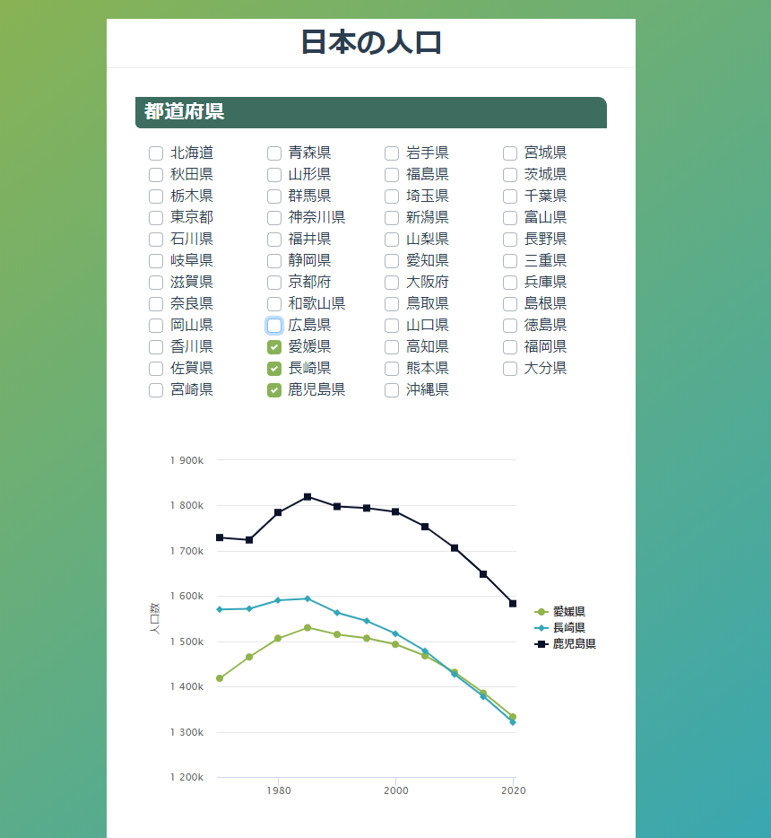

# yumemi_frontend_submission

ゆめみようなフロントエンド用です。



## プロジェクト詳細

* 都道府県別の総人口推移グラフを表示するSPA(Single Page Application)を構築せよ


### 内容
1. RESAS(地域経済分析システム) APIの「都道府県一覧」からAPIを取得する
2. APIレスポンスから都道府県一覧のチェックボックスを動的に生成する
3. 都道府県にチェックを入れると、[RESAS API](https://opendata.resas-portal.go.jp/docs/api/v1/index.html)から選択された都道府県の「人口構成」を取得する
4. 人口構成APIレスポンスから、X軸:年、Y軸:人口数の折れ線グラフを動的に生成して表示する

### 制約
* Reactをベースに、最新版(9/26時点で v16.5.2)でSPAを構築すること (Reactではなく、Angular/Vue/RiotなどJavaScriptのフレームワークでも構わないです)
* 都道府県一覧および総人口情報は[RESAS API](https://opendata.resas-portal.go.jp/docs/api/v1/index.html)のデータを用いること
* グラフは Highcharts や Rechart.js サードパーティ製のグラフライブラリを用いて描画すること
* グラフライブラリは任意のものを用いる
* Google Chrome最新版で正しく動くこと

## プロジェクト設定
```
npm install
```

### 開発するためのコンパイルとホットリロード
```
npm run serve
```

NOTE: このプロジェクトはグローバルのvue-cliとvue-cli-serviceを使う。上記のコマンドが失敗したらvue-cli-serviceをインストールしてください。(`npm install -g vue-cli vue-cli-service`)

### 本番環境をデプロイするためのコンパイルと縮小
```
npm run build
```

### リントやファイルを自動に直す
```
npm run lint
```

### カストマイズ
[Configuration Reference](https://cli.vuejs.org/config/)を調べてください

## TODO (EN)

This is not a production-ready project. If I were building this for a production site, some of the improvements I would make are below:

* Use .env files to hold the RESAS API key
* Either hardcode or cache prefecture information.
* Cache API results for population information in localstorage (currently caches in memory)
* Add API error handling and display via Bootstrap Toasts
* Import only what is required from Bootstrap-Vue (Tree-shaking happens when building for production)
* Split PrefecturePopulations into more components
* Remove !important in CSS, import Bootstrap styles then overwrite them

## TODO (JA)

このコードは本番環境のためのコードではございません。本番環境にリリースするために下記の修正をします。

* RESAS APIキーのために.envファイルを追加します。
* 都道府県の情報をハードコードかキャシューします。
* API応答の人口について情報をローカルストレージにキャシューします。 (現状はメモリーにキャシューしています)
* エラー処理とAPIエラー発生時用にBootstrapトーストを追加します。
* Bootstrap-Vueから必要な部分のみインポートします。　（本番環境のためにtree shakingの機能もあります)
* PrefecturePopulationsのコンポーネントをさらに分けます。
* CSSの「!important」を消します。消すためにはBootstrapのスタイルをインポートしてそこから上書きします。

## Assumptions

Based on frontend_wireframe.jpg (shown above in this README.md), it is assumed that only years 1970 to 2020 will be displayed.

frontend_wireframe.jpg (上記に表示されているイメージ)によって、1970年から2020年までの人口情報を表示することを想定しています。